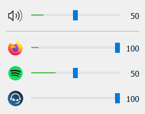

# VolumeController #

This project was created because the default windows audio mixer does not allow simple manipulation of individual audio session,
e.g. restoring a session to its maximum volume is almost impossible as it is not relative but absolute 
and you have to hit the current master volume exactly or the master volume will be increased and all other sessions fitted relatively.

## Features ##
* Show and control sessions of the default audio output device
* Fine control audio volume sliders (scroll steps: normal = 2, shift = 5, control = 1)
* Filter sessions (show and hide inactive sessions).
* Peak meters
* Lightweight
* No Windows App, therefore no Windows Store required to install it

## Installation ##
I am currently not providing a packed binary so the only way to get the program is to compile it yourself.
However this shouldn't be hard since a CMake file is contained and I did not use any libary except [Qt5](https://www.qt.io/).

A config file is written to the folder of the executable, meaning the program needs to have write rights for this folder.

## Supported operating systems ##
Only tested on Windows 10 1903 (May 2019 Update) so far. However it should work on any version.
The layout will break below Windows 10 since the sliders changed.

*Disclaimer:* The code of this project is heavily inspired by [EarTrumpet](https://github.com/File-New-Project/EarTrumpet).